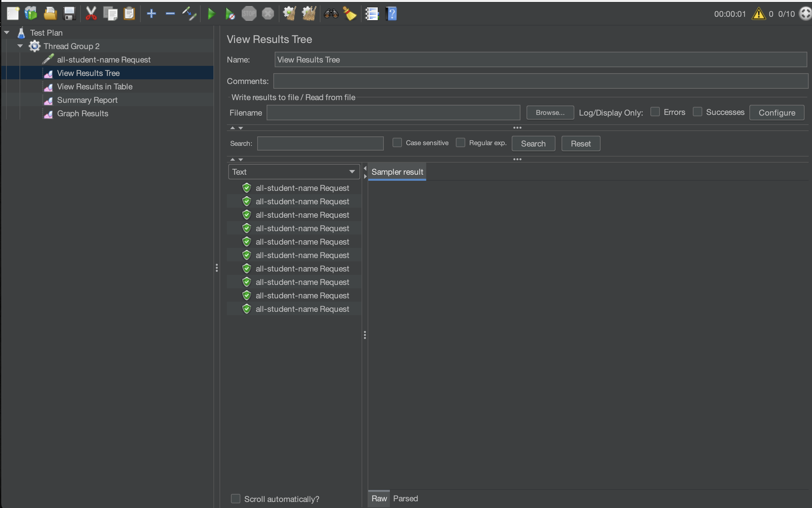

# all-student-name JMeter

# highest-gpa JMeter

# all-student-name CLI

# highest-gpa CLI

# Conclusion
Setelah profiling dan proses optimisasi dilakukan JMeter menunjukan adanya peningkatan performa secara signifikan.

# Reflection
1. JMeter digunakan untuk melihat performa saat menerima banyak request. IntelliJ Profiler digunakan untuk melhat pada bagian mana kode yang harus diperbaiki
2. Profiling membantu dalam menemukan bagian mana dalam kode yang menjadi kelemahan dan perlu di refactor
3. Ya, karena IntelliJ Profiler memberikan data yang lengkap yang diperlukan untuk menganalisis kode.
4. Kesulitan yang saya hadapi adalah data untuk pengujian yang tidak realistis dan hasil pengujian yang tidak konsisten. Solusinya adalah dengan mengombinasikan tools yang beragam atau menjalankan tes beberapa kali untuk hasil yang lebih akurat.
5. IntelliJ Profiler dapat membantu mengidentifikasi bottlenect dengan akurat sehingga memudahkan dalam proses refactor.
6. Solusinya adalah dengan mengecek ulang secara manual serta menggunakan JMeter atau IntelliJ Profiler dalam konteks yang tepat.
7. Saya mengidentifikasi bottleneck yang paling berefek pada pada perfora. Strategi untuk memastikan kebenaran fungsionalitas dari program saya adalah dengan menggunakan unit dan integration testing..

